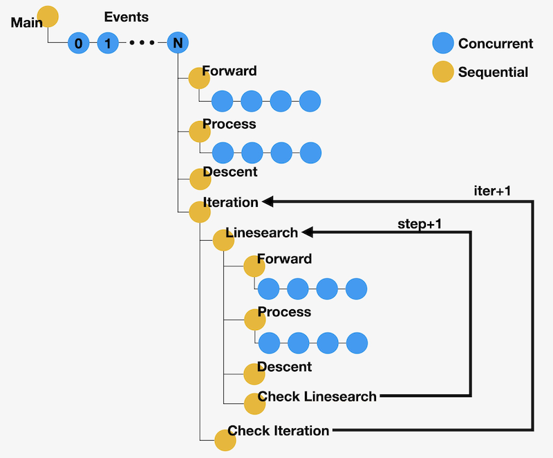

# nnodes

A simple workflow manager.

## What nnodes does

nnodes is a workflow manager that makes your life easier when defining or running complicated jobs either in your local computer or in a large-scale cluster. The basic element of nnodes is called a ```node```, which can:

- Call a Python function or run a shell command.
- Contain any number of child nodes which can be executed either sequentially or concurrently.
- Be assigned with properties which will be propagated to child nodes.

The execution status each ```node``` will be saved so that you don't need to re-run any completed tasks when a job fails or exceeds the scheduled walltime. nnodes can also manage the parallel execution of multiple MPI tasks. Once you define MPI tasks in different nodes, nnodes will figure out the best way to run these.

## Why you may need a workflow manager
Below is an example of an iterative inversion workflow (thanks [@lsawade](https://github.com/lsawade) for the figure and example). We want to obtain the parameters of N events. Each event involves a few forward modeling and data processing steps. Without a workflow manager, you might encounter the following problems:

- It's not always possible to finish the whole workflow within a single run, so progress backup is necessary.
- Managing parameters for functions can be tedious. Each function may require at least 10 arguments, like event, iteration, step, etc.
- It's more effecient to run expensive tasks like forward modeling in parallel, but some clusters don't like it if you call 1,000 ```mpiexec``` commands at the same time.
- You may want to test the workflow in a local computer and do the actual computation in a remote cluster or even many different clusters. This may involve a lot of code changes.

nnodes solves all these problems with ease. See ```examples/gaussian``` for a detailed explanation.



## Alternatives
If you are looking for more options, below are some projects worth checking out:

- [Ensemble Toolkit](https://radical-cybertools.github.io/entk/index.html)
- [FireWorks](https://materialsproject.github.io/fireworks/)
