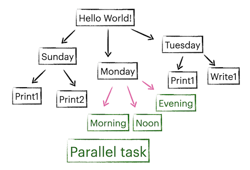

# Hello World!

In this section, you will create two files: [```config.toml```](https://raw.githubusercontent.com/icui/nnodes/main/examples/hello/config.toml) and [```hello.py```](https://raw.githubusercontent.com/icui/nnodes/main/examples/hello/hello.py). The structure of ```hello.py``` is shown below.


## Create config.toml
Use ```nnmk``` as mentioned in introduction.

Enter `3` (personal computer) in system selection.<br>
Enter ```hello``` when prompt ```module containing the main task```.<br>
Enter ```main``` when prompt ```function name of the main task```.

## Print "Hello World!"
We have chose function ```main``` in ```hello.py``` as our main task. We can create the file and write a function:
```py
# hello.py
def main(node):
    print("Hello World!")
```
A task function by default accepts its ```Node``` as its only argument. In this case, the ```node``` passed to ```main``` is the top level ```root``` node. After creating the file, type ```rm -f root.pickle && nnrun```, you will see the output (```rm -f root.pickle``` clears the progress of the previous nnrun).

## Add child tasks
In a task function, you can add a child node with either a function or a shell command as its task.

Add a child node with a function
```py
node.add(task_func)

def task_func(node):
    print('Hello from func!')
```
Add a child node with a shell command
```py
node.add('echo "Hello from echo!"')
```

## Add child tasks with properties
Properties are define in keyword arguments in ```Node.add()```.
```py
node.add(print_today, day='Sunday')  # Today is Sunday.
node.add(print_today, day='Monday')  # Today is Monday.
node.add(print_today, day='Tuesday')  # Today is Tuesday.

def print_today(node):
    print(f'Today is {node.day}.')
```

Properties will be propagated to child nodes, unless overwritten.

```py
node.add(print_sunday, day='Sunday')

def task_sunday(node):
    node.add(print_today)  # Today is Sunday.
    node.add(print_today, day='the day before Monday')  # Today is the day before Monday.
```

## Parallel tasks
You can execute all child tasks concurrently by setting the property ```concurrent```. These tasks should either be [async functions](https://docs.python.org/3/library/asyncio-task.html#awaitables) or background tasks (MPI or background process). The following example contains 3 tasks with execution time 1s, 2s and 3s. But the total execution time is 3s because these tasks are executed in parallel.

```py
node.add(task_monday, day='Monday', concurrent=True)

def task_monday(node):
    node.add(print_morning)  # add an async function that lasts 1s
    node.add_mpi('sleep 2 && echo "Good afternoon."', 1)  # add a mpi task with 1 CPU that lasts 2s
    node.add_mpi('sleep 3 && echo "Good evening."', use_multiprocessing=True)  # add a background process that lasts 3s

async def print_morning(node):
    from asyncio import sleep
    await sleep(1)
    print('Good morning')
```


## Directory utilities
Node offers [file system utilities](https://icui.github.io/nnodes/reference/directory.html) like ```cp```, ```mv```, ```read```, ```write```. By default, child tasks use the same directory as its parent, but can be changed by passing a ```cwd``` parameter.
```py
node.add(task_tuesday, day='Tuesday', cwd='tue')

def task_tuesday(node):
    node.add(print_today)
    node.write(node.day, 'today.txt')  # writes today.txt in ./tue
    node.add('echo "noon" > time.txt', cwd='noon')  # writes time.txt in ./tue/noon
```
