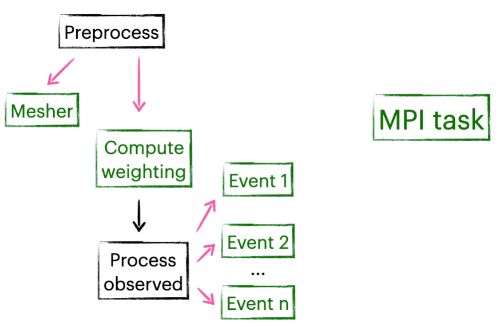
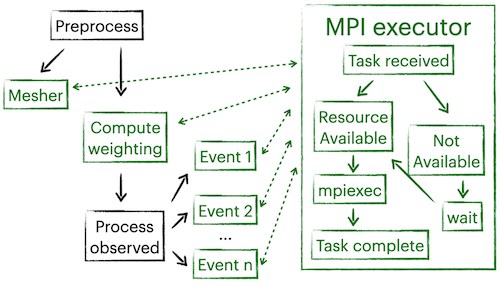

# MPI execution
The following example shows a use case for the parallel execution of multiple MPI tasks. In the preprocessing step, the mesher is called to generate the mesh for the current model. Meanwhile, there are still some remaining processors to process the data. After weightings are computed, we begin processing observed data for n events. There are a total of n+2 MPI tasks, mesher can run simultaneously with all other tasks, while processing observed data needs the result of weighting computation. 

Nnodes can execute the workflow efficiently because of its concurrent structure, shown in the figure below. Background tasks like MPI calls or subprocesses are automatically grouped to a single executor while the main process remains single-threaded. This allows users to spawn thousands of background tasks (as long as the cluster allows) while not having to worry about compatibility or stability issues cased by multiprocessing. It also scales well, there is no need to manually adjust the workflow in order to make the most of the resources of a cluster.

