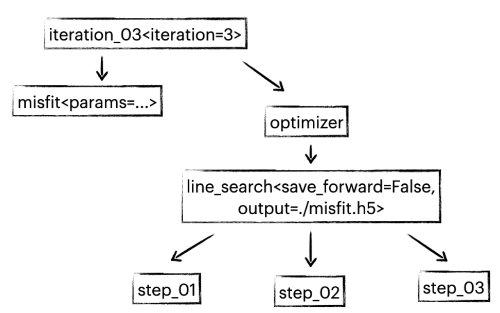
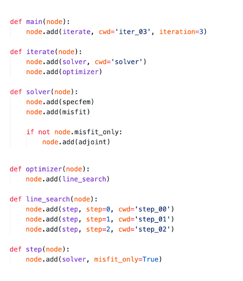
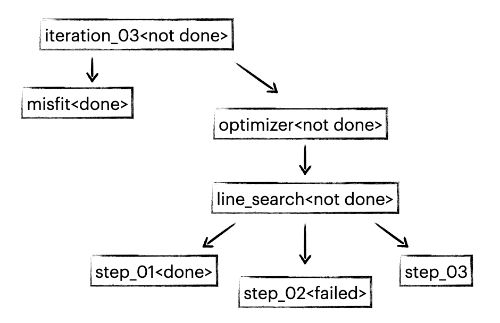

# Workflow

## Property and directory
Nnodes introduces a hierarchical structure to manage properties and directories. This is inspired by the styling of HTML document, in which properties will by default propagate to the child nodes and can be overwritten if necessary. Below is an example a partial full waveform inversion workflow. Functions in the workflow require parameters like iteration number, simulation mode, current model, etc. With nnodes, these parameters are only required to be defined once.



The code to define the structure above is appended below. The same mechanism applies to directories as well, the function ```step_03```, for instance, is run under directory ```iter_03/step_03``` because cwd parameter is passed when defining the iteration and search step.



## Progress control
A node has four possible states: ```pending```, ```running```, ```done```, ```terminated```, or ```failed```. The following example shows the behavior of nnodes when a node fails.



When any node is terminated or fails, the workflow will exit. In this example, the line search ```step_02``` fails and the workflow will exit. By default, if this is the first time that ```step_02``` fails, the current job will automatically re-submit. You can also choose to re-submit manually. When the workflow runs again, it will directly go to step_02 because all previous steps have been marked as ```done```.

It is also possible to manually tweak a node state. If, for example, you wish to run misfit calculation again, you can simply set the state of misfit to ```pending```, and when running the workflow again, the workflow will redo the misfit calculation.
