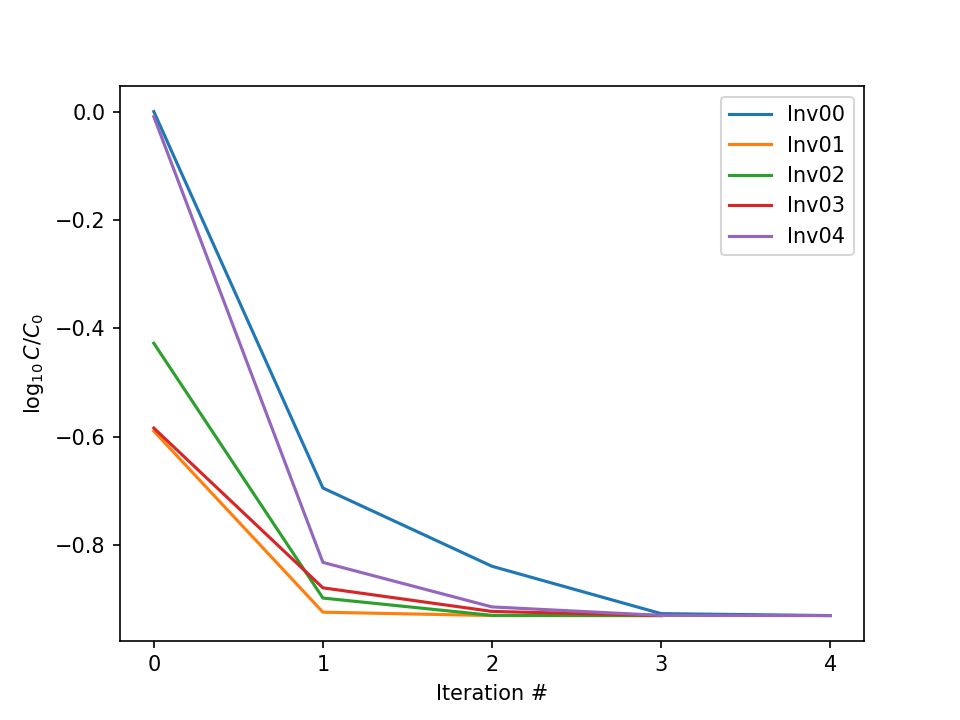
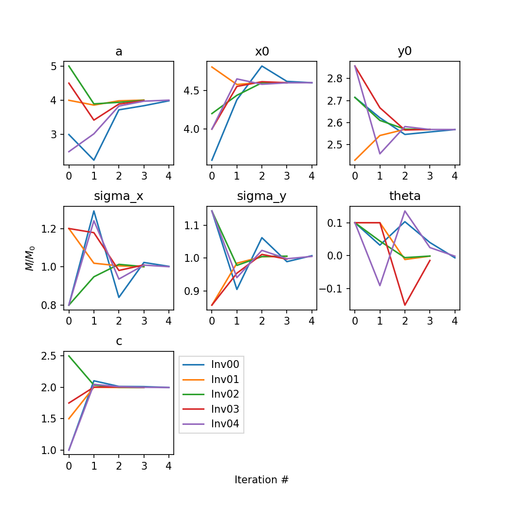
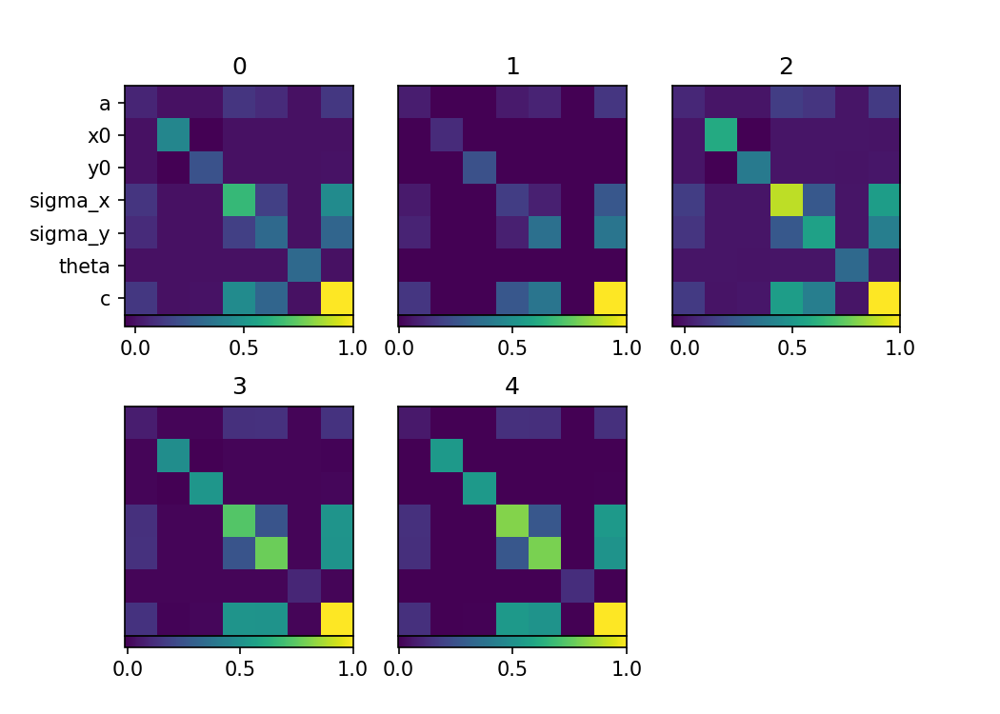

# Inversion for the parameters of a 2D Gaussian

## Introduction
The purpose of this directory is to show the workflow creation on a very 
simple example. The example shows how to arrange a workflow with I/O, s.t. you 
can run different tasks that require more resources sequentially and in 
parallel, making this an excellent example for high performance computing.
Note however that this example is not aimed at being run on HPC clusters, but 
rather gives you a quick overview on how to work with the workflow manager on 
your own machine. Applying this to an HPC Cluster afterwards is "peanuts."

## Background for the workflow

The main script is `workflow.py`, which contains the function `main` "runs" everything. The subdirectory `functions` contains all the functions that are 
necessary to read and write the different aspects of the workflow, as well as
some plotting functions.

The inversion itself is based on the Gauss-Newton algorithm. We use the 
Gauss-Newton algorithm because the partial derivatives are well defined for a 
2D Gaussian misfit, but they aren't linear. The Gaussian itself is modeled
after the 
[2D Gaussian](https://en.wikipedia.org/wiki/Gaussian_function#Two-dimensional_Gaussian_function) 
description on Wikipedia. So, the model parameters are: 
1. `a` -- amplitude
2. `x0` -- x offset
3. `y0` -- y offset
4. `sigma_x` -- standard deviation in `x`
5. `sigma_y` -- standard deviation in `y`
6. `theta` -- angle
7. `c` -- overall offset

The workflow runs 5 inversions for the same data concurrently with different initial models.

## Quick Start 

Make sure you have python install with `numpy` and `matplotlib`.

1. Install `nnodes`
    ```bash
    # Change dir to the nnodes repo
    cd path/to/nnodes

    # Install it in editable mode
    pip install -e .
    ```
2. Run the workflow
    ```bash
    # Change dir to the examples Gaussian directory
    cd examples/gaussian

    # Run nnodes 
    python nnrun
    ```
3. Once run, the workflow saves `root.pickle` into the run dir to see 
   progress. Make sure that you delete it before repeating step 2.
   ```bash
   rm -f root.pickle 
   ```

This will output many things to your terminal, wait until done.

To plot some outputs you can run the following:

```bash
python -m functions.plot optimizations
```

The function will/should output three figures: `.../gaussian/costs.png`, which 
shows the cost evolution of the 5 inversions normalize to the maximum of all 
costs, `.../gaussian/models.png`, which shows the evolution of the model 
parameters scaled by the scaling vector defined in `make_data` (s. below in 
special functions), and `.../gaussian/hessians.png`, which shows the 
Gauss-Newton Hessians for `inversion00`.


1. _**Evolution of the cost function for the five inversions**_
    


2. _**Evolution of the model parameters for the five inversions**_
    


3. _**Evolution of the Gauss Newton Hessian for `inversions00`**_
   


## Setup

### Resource setup

The resources for the job as well as walltime etc. are defined in the 
`config.toml` file (pasted below)

```toml
[job]
system = ["nnodes.job", "SingleCore"]
name = "gaussian"
nnodes = 1
account = "GEO111"
walltime = 10.0
gap = 2.0
debug = true

[root]
task = ["workflow", "main"]
task_nnodes = 1
```

Important parameters are 
- `job.system` -- `system` defines the sytem you are running on.You can technically 
  define your own, but that goes beyond the scope of this tutorial. For now,
  be happy with the single core definition. (Job specifications are defined 
  in `nnodes/job.py`)
- `root.task` -- `task` defines the function you want to run. In this case, we
  defined the script `workflow.py` and the function that contains the workflow
  in the script is `main()`. 

Note that when you `python nnrun` you have to have a `config.toml` which points
to your workflow and your job description.


### Workflow
The entire workflow is located in `workflow.py` in the `examples/gaussian` 
directory. The structure of the inversion is as follows, where you can think of 
the `0` as `nodes`. Then, numbered `nodes` are computed sequentially and 
`nodes` a `-` are computed concurrently.

```
Main
|
0---- - inversion00
|    |
|    0---- 1. prepare_dir
|    |    |
|    |    0---- 1. optimdir   -> Optimization directory
|    |    0---- 2. make_data  -> Data, Optim. params., init. model 
|    0---- 2. inversion
|         |
|         0---- 1. iteration <<<------------- + 1 iteration --------------|
|               |                                                         |
|               0---- 0. If 'iter==0'                                     |
|               |     0---- 1. all_forward -> Forward, Fréchet            |
|               |     |    |                                              |
|               |     |    0---- - compute_forward                        |
|               |     |    0---- - compute_frechet                        |
|               |     |         |                                         |
|               |     |         0---- - compute_frechet(param0)           |
|               |     |         0---- - compute_frechet(  ..  )           |
|               |     |         0---- - compute_frechet(paramN)           |
|               |     |                                                   |
|               |     0---- 2. compute_cgh -> Cost, Gradient, Hessian     |
|               |          |                                              |
|               |          0---- - compute_cost                           |
|               |          0---- - compute_gradient                       |
|               |          0---- - compute_hessian                        |
|               |                                                         |
|               0---- 1. compute_descent   -> Descent direction           |
|               |                                                         |
|               0---- 2. compute_optvals   -> (Stepsize/Wolfe)            |
|               |                                                         |
|               0---- 3. linesearch                                       |
|               |     |                                                   |
|               |     0---- 1. search_step <<<------- +1 step -------|    |
|               |          |                                         |    |
|               |          0---- 1. compute_new_model -> update M    |    |
|               |          0---- 2. all_forward (s. above)           |    |
|               |          0---- 3. compute_cgh (s. above)           |    |
|               |          0---- 4. compute_optvals (s. above)       |    |
|               |          0---- 5. search_check -> add step? >>>----|    |
|               |                                                         |
|               0---- 4. iteration_check -> add iteration? >>>------------|
|
0---- - inversion01
|    |
|    0 ...
:
0---- - inversion04
     |
     0 ...
```

As you can see from the above structure we can run `inversionXX`s concurrently
and some tasks sequentially. Of course, each of the sub functions are more 
involved than what is show here, but you get the gist.


## Special Functions

### `function/utils.py -- optimdir()`

`optimdir()` takes in a path and creates a skeleton directory structure for an 
optimization at the path. It creates subdirectories `meta`, `modl`, `hess` etc. 
for the metadata, models and hessians at iterations and linesearches, and more.
Just inspect `optimization/inversion00` to see how the directory looks after the
program has run.

### `function/make_data.py -- make_data()`

`make_data()` creates several things. First of all it creates data from an 
initial model and added noise and it created initial models for `5` separate 
inversions that run concurrently. It stores the coordinates (X,Y), the scaling 
vector, the optimization parameters and the model names in the `optimizations/
inversionXX/meta/` subdirectory.


